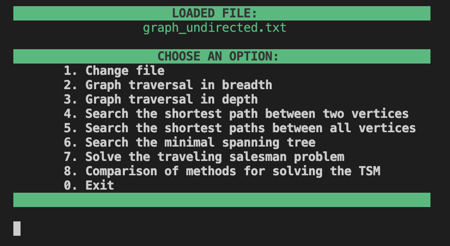
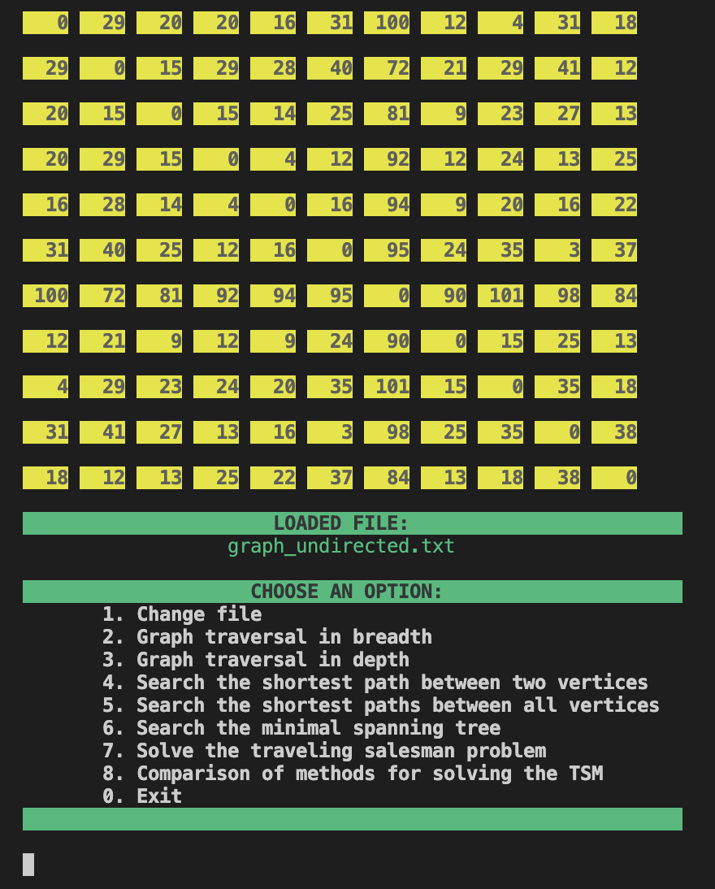
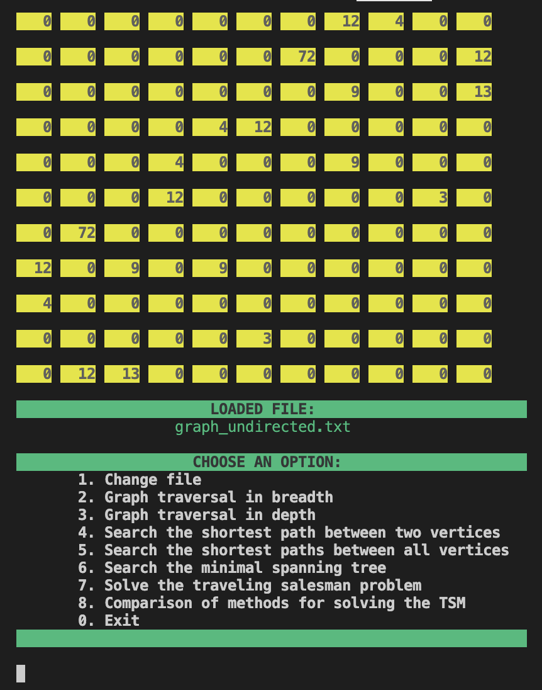
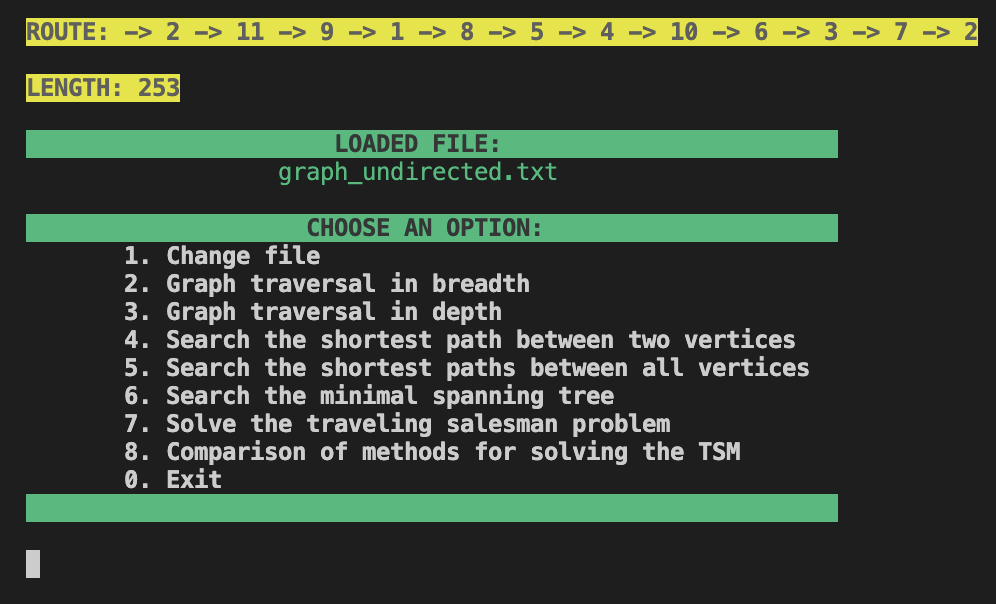
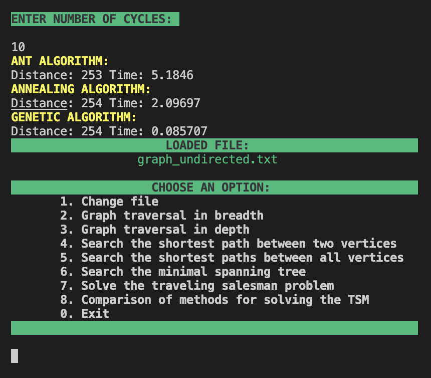

# Simple Navigator v1.0
The "Simple Navigator v1.0" is an app written in C++. The console application provides implementation several algorithms on graphs, such as traversal, finding shortest paths, finding the minimum spanning tree and solving travelling salesman problem.

## Features
- Console interface

  

- Load graph as adjacency matrix from a specific file.
- Non-recursive depth-first search in the graph.
- Breadth-first search in the graph from a given vertex.
- Searching for the shortest path between two vertices in a graph using Dijkstra's algorithm.
- Searching for the shortest paths between all pairs of vertices in a graph using the Floyd-Warshall algorithm.

  

- Searching for the minimal spanning tree in a graph using Prim's algorithm.

  

- Solving the traveling salesman's problem using the ant colony algorithm.
- Solving the traveling salesman's problem using the annealing simulation algorithm.
- Solving the traveling salesman's problem using the genetic algorithm.

  

- Performing a comparison of speed of the three algorithms for TSM problem.

  

## License
Copyright (c). All rights reserved.
